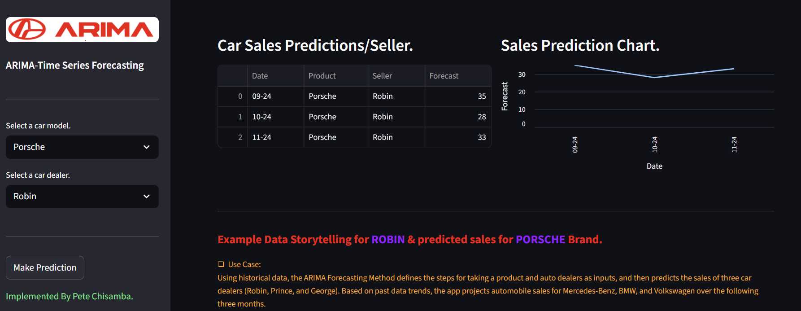

# 🚗 Autohaus Absatzprognose mit ARIMA  
### KI-gestützte Entscheidungsunterstützung für Distributoren


---

[English](..\EN\README.md) | [German](README.md)

## ✨ Geschäftsproblem

Ein **Fahrzeugdistributor** arbeitet mit mehreren Händlern zusammen und möchte wissen:

✔ Wie viele Fahrzeuge wird jeder Händler verkaufen?  
✔ Welche Marke wächst, welche fällt?  
✔ Wie entwickelt sich der Absatz in den nächsten Monaten?  
✔ Wo sollten Lagerbestand, Marketing und Incentives optimiert werden?  

Statt Bauchgefühl → **Datenbasierte Prognose**.

---

## 🧠 Lösung

Die Anwendung nutzt **ARIMA Zeitreihenprognosen**, um aus historischen Verkaufszahlen die **nächsten 3 Monate** vorherzusagen – für:

- 🚘 Fahrzeugmodell  
- 🤝 Händler / Verkäufer  

Die Ergebnisse werden bereitgestellt als:

📋 **Prognosetabelle**  
📈 **Trenddiagramm**  
📝 **automatische Business-Interpretation**

---

## 🖥 Anwendungsvorschau


---

## ⚙️ Funktionsweise



### **Eingabe**
Der Nutzer wählt:
- Produkt → *Mercedes-Benz, Volkswagen, Audi, Porsche, BMW*
- Verkäufer → *George, Prince, Robin*

### **Verarbeitung**

1. Filterung der historischen Daten  
2. Aufbau der Zeitreihe  
3. Training eines **ARIMA(2,1,1)** Modells  
4. Prognose der nächsten 3 Monate  
5. Aufbereitung für Entscheider  

### **Ausgabe**

✅ Absatzprognose pro Händler  
✅ Visuelle Darstellung als Linie  
✅ Management-taugliche Insights  

---

## 🔮 Beispielergebnis

Nach Klick auf **Make Prediction** sieht der Distributor sofort:

| Datum | Produkt | Verkäufer | Prognose |
|------|------|------|------|
| 09-24 | Porsche | Robin | 35 |
| 10-24 | Porsche | Robin | 28 |
| 11-24 | Porsche | Robin | 33 |

Damit lassen sich schneller entscheiden:

- Bestellmengen  
- Zielvereinbarungen  
- Bonusmodelle  
- Kampagnenzeiträume  

---

## 🏗 Architekturüberblick

```

CSV Historische Daten
↓
Filter (Produkt + Verkäufer)
↓
Zeitreihe
↓
ARIMA Training
↓
3-Monats-Forecast
↓
Tabelle + Diagramm + Storytelling

```

---

## 📂 Projektstruktur

```

car-part-sales.csv        # historische Datenbasis
img/                      # UI Bilder
app.py                    # Streamlit Anwendung
formatted_characters.py  # Styling & Storytelling
requirements.txt         # Abhängigkeiten
README.md

````

---

## 🧩 Verwendete Technologien

| Bereich | Stack |
|------|------|
Datenverarbeitung | Pandas |
Forecasting | Statsmodels ARIMA |
Datumslogik | dateutil |
Frontend | Streamlit |
Visualisierung | Streamlit Charts |

---

## 🔁 Mögliche Erweiterungen

⭐ Prophet oder LSTM Vergleich  
⭐ Konfidenzintervalle  
⭐ Umsatz = Absatz × Preis  
⭐ Händler-Ranking  
⭐ What-If Simulationen  
⭐ API / Cloud Deployment  
⭐ Anbindung an Live-Datenbanken  
⭐ Automatisches Re-Training  
⭐ PDF / Excel Reports  

---

## ▶️ Lokal ausführen

```bash
pip install -r requirements.txt
streamlit run app.py
````

---

## 🎯 Was dieses Projekt beweist

✔ Machine Learning im Business-Kontext
✔ Rohdaten → Entscheidungsgrundlage
✔ Entwicklung nutzbarer Analytics Apps
✔ Zeitreihenkompetenz
✔ Visualisierung für Stakeholder
✔ Data Storytelling
✔ End-to-End Umsetzung

---

## 👤 Autor

**Pete Chisamba**
Data & AI Enthusiast mit Fokus auf Decision Intelligence, Automatisierung und messbaren Geschäftswert.